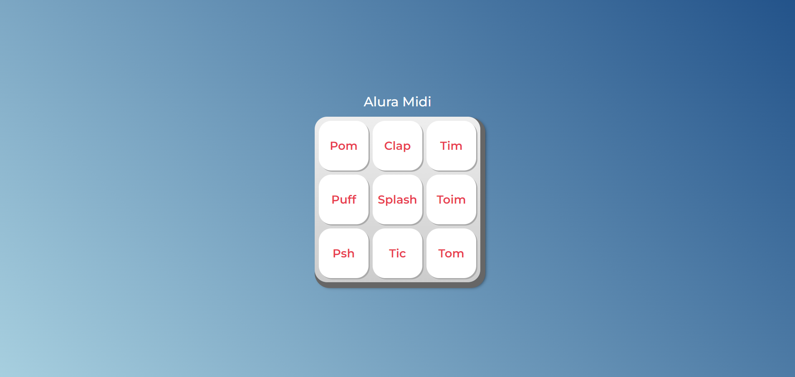

# Alura midi
Projeto criado para praticar a manipulação de elementos com javascript. 
Ao clicar em uma tecla, um som respectivo irá ser tocado.
Este projeto faz parte da formação **JavaScript para Web: Crie páginas dinâmicas**, na plataforma Alura.

# Resultado final

